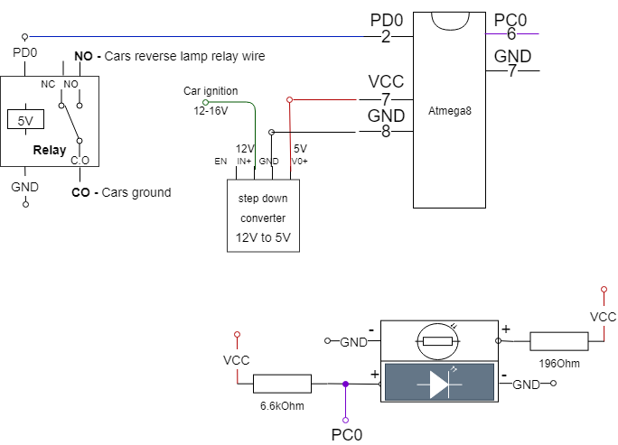
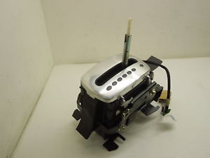
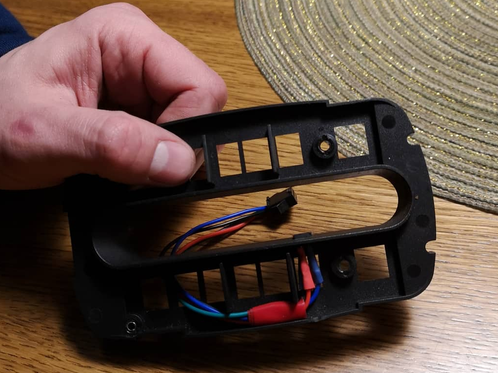

# Photo-optron switch
This projects main application is to hack a car's automatic gearbox reverse drive relay.

If your car's selector does'nt see the position of the selector, you can use this device. 

**Device schematic:**

**Photo-optron sensor mounting position:**

